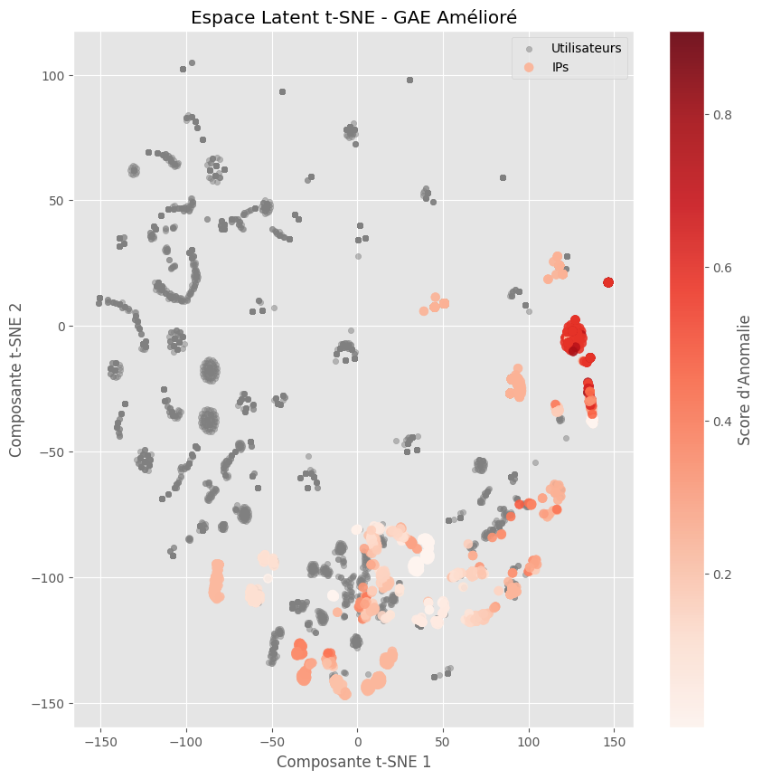

# Credential Stuffing Detection with Graph Auto-Encoders

Detecting **credential stuffing**, distributed brute force and account-takeover patterns in authentication logs — by modeling login events as a **heterogeneous graph** (users, IPs, user-agents, countries) and training **Graph Auto-Encoders (GAE/VGAE)** to learn what "normal" connection structure looks like. Anomalies are the edges the model fails to reconstruct.

Engineering project (PING) at Télécom Saint-Étienne, built on **real production authentication logs** from an industry partner.

> ⚠️ **The data is not in this repo.** The logs are real (pseudonymized) production events and stay private — along with the graph objects and trained weights derived from them. What you get is the full method: preprocessing, graph construction, models, and evaluation.

## Why graphs?

Rule-based detection looks at events in isolation. But modern attacks are *relational*: one IP targeting many accounts, one account hit from many IPs/user-agents. The hypothesis: the **structure of the user–IP–UA graph** carries the signal that row-by-row analysis misses.

## Pipeline

1. **`src/pretraitement.ipynb`** — cleaning + behavioral feature engineering (connection frequency, user-agent diversity, per-IP failure rate)
2. **`src/construcion_graphe.ipynb`** — heterogeneous bipartite graph construction (PyTorch Geometric), feature encoding & normalization
3. **`src/gae_model.ipynb`** — GAE & VGAE training, anomaly scoring by reconstruction error, t-SNE visualization

## Results

| Model | Test AUC | Test AP |
|---|---|---|
| Original GAE | 0.37 | 0.62 |
| **Improved GAE (behavioral features)** | **0.93** | **0.96** |

The jump comes from injecting behavioral features into node attributes rather than relying on pure structure.



## Docs

Full write-ups (French): [technical documentation](doc/doc_tech.pdf) · [user documentation](doc/Doc_user.pdf)

## Setup

```bash
pip install -r requirements.txt
```

The notebooks expect a CSV of auth events (`user, ip, user_agent, event_type, timestamp, country, city`) — bring your own logs.
